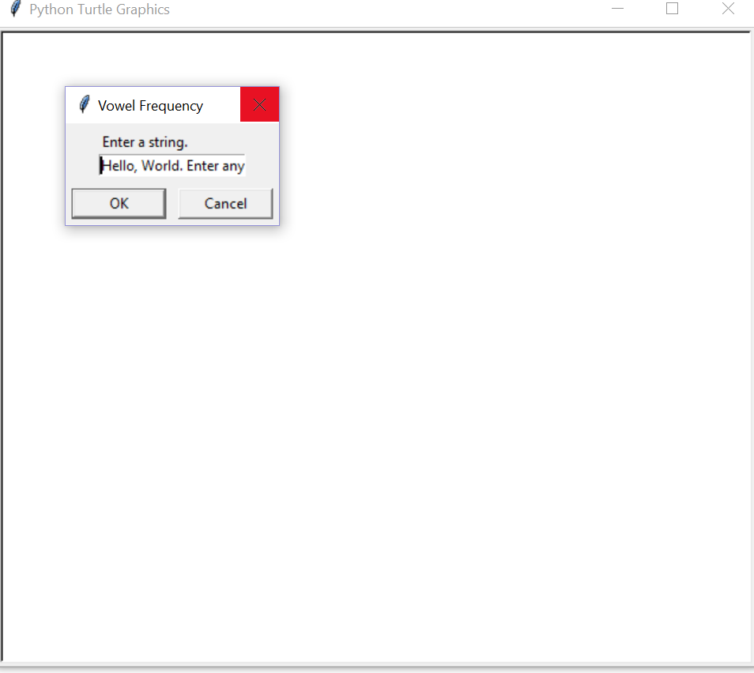
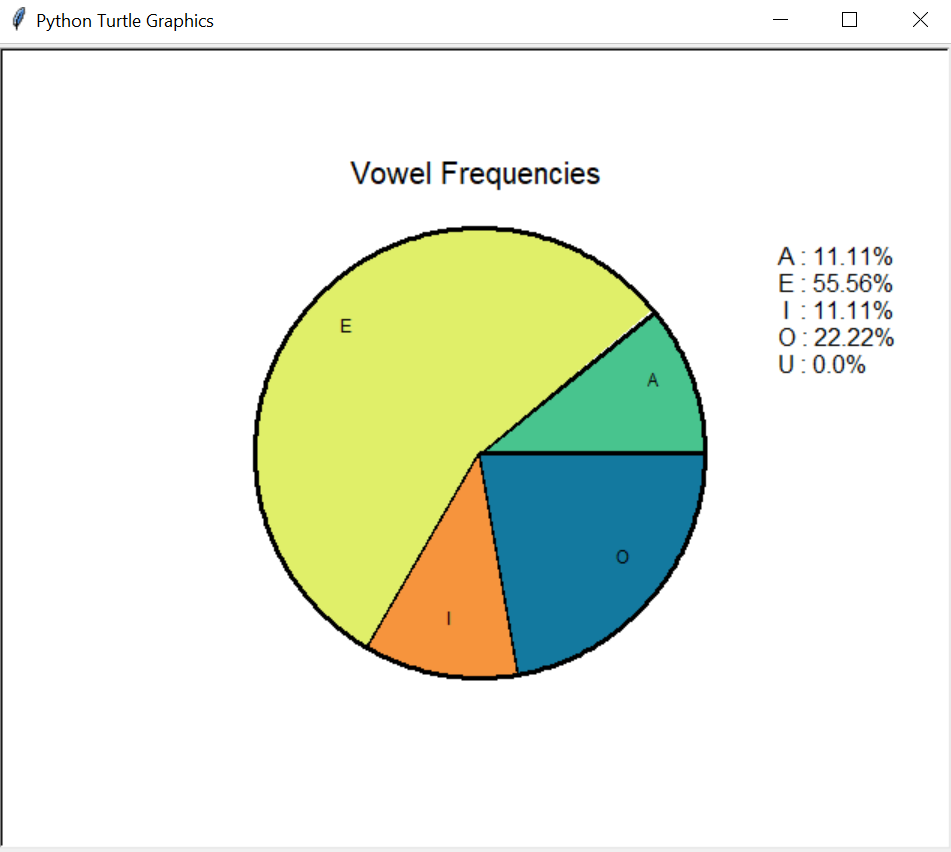
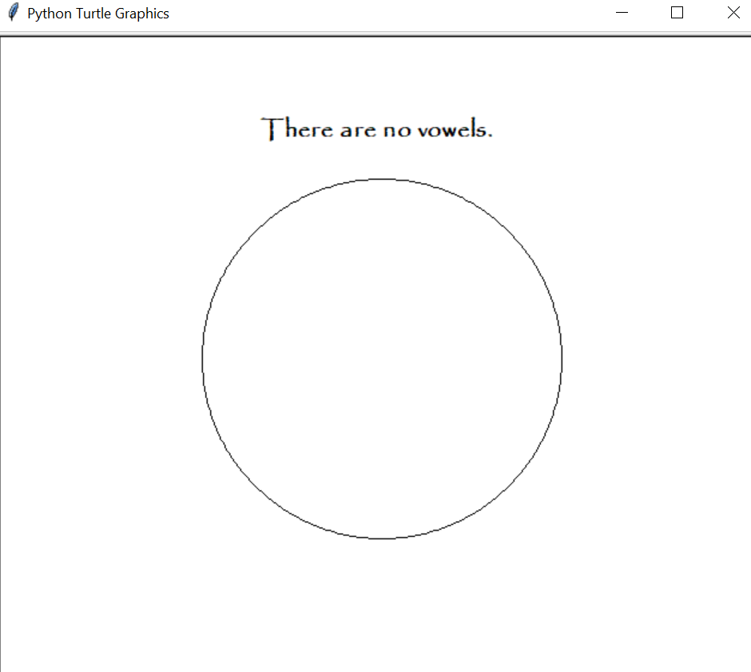

# vowel_count_piechart

This program was created for a class at the University of Minnesota. It takes any string input and creates a pie chart showing the frequencies of each vowel in the string. While vowel frequencies may not be particularly useful, this same logic can be applied to longer pieces of strings or entire words and it has been very useful for text mining for data analysis.

Start by entering a string:

Then click enter or ok to see the frequencies:

If there are no vowels:

